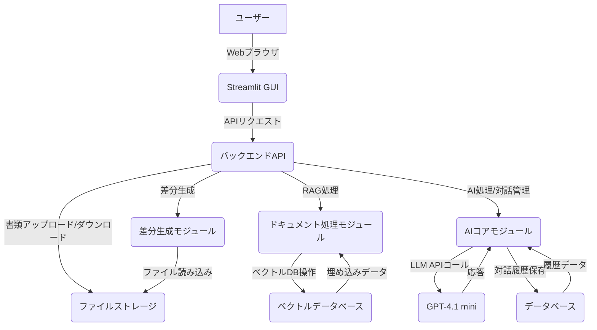

# ISO/プライバシーマーク等規格対応書類更新AIエージェント詳細仕様書

## 1. はじめに

## 2. システム概要

## 3. 機能要件

## 4. 非機能要件

## 5. システムアーキテクチャ

## 6. 開発計画

## 7. テスト計画

## 8. エラーハンドリング

## 9. モジュール設計

## 10. 今後の展望

## 1. はじめに

本仕様書は、ISOやプライバシーマークなどの規格を取得している企業向けに、既存の書類を定期的に更新される規格内容に合わせて自動的に書き換えるAIエージェントの開発に関する詳細な要件と設計を記述するものである。本システムは、AI技術、特にRAG（Retrieval Augmented Generation）を活用し、ユーザーとの対話を通じて、新規格に適合した書類作成を支援することを目的とする。これにより、企業は規格更新に伴う書類修正作業の負担を大幅に軽減し、常に最新の規格に準拠した状態を維持できるようになる。

### 1.1. 目的

- 規格更新に伴う書類修正作業の自動化と効率化。
- AIによる高度な文書理解と生成能力の活用。
- ユーザーとの対話を通じた、柔軟かつ正確な書類作成支援。
- 新旧書類の差分レポート生成による、変更点の明確化と監査対応の容易化。

### 1.2. 対象読者

- 本AIエージェントの開発に携わるエンジニア、プロジェクトマネージャー。
- 本システムの導入を検討している企業の担当者。
- 本システムの運用・保守を担当する関係者。

### 1.3. 開発環境

- **プログラミング言語**: Python 3.11
- **AIモデル**: GPT-4.1 mini
- **GUIフレームワーク**: Streamlit
- **外部ライブラリ**: 信頼できるものを適宜使用
- **APIキー**: 環境変数から取得

## 2. システム概要

本AIエージェントは、企業が保有する既存の規格関連書類と、新たに更新された規格内容を比較し、AIの能力を用いて既存書類を新規格に適合するように自動的に書き換えるシステムである。このプロセスは、ユーザーがGUIを通じて書類をアップロードすることから始まる。AIはアップロードされた書類の意味内容をRAG（Retrieval Augmented Generation）の考え方に基づいて深く理解し、同時に新規格の内容も解析する。AIが自動的に判断し書き換えが可能な項目については、その処理を実行する。しかし、AIの判断だけでは対応が難しい、あるいは新たな解釈が必要となる項目が出現した場合には、AIはユーザーに対して対話形式で質問を投げかけ、その回答に基づいて書類の修正を進める。最終的に、新規格に適合した書類がマークダウン形式で生成され、同時に新旧書類間の差分レポートも出力されることで、変更点が明確に可視化される。

### 2.1. 主要コンポーネント

本システムは以下の主要コンポーネントで構成される。

- **ユーザーインターフェース (GUI)**: Streamlitを用いて開発され、ユーザーが既存書類と新規格内容をアップロードし、AIとの対話を行うためのインタフェースを提供する。
- **ドキュメント処理モジュール**: アップロードされた既存書類を解析し、RAGに適した形式（例：ベクトル埋め込み）に変換する。また、新規格内容も同様に解析する。
- **AIコアモジュール**: GPT-4.1 miniを基盤とし、ドキュメント処理モジュールからの情報と新規格内容を統合し、書類の書き換えを行う。ユーザーとの対話管理も担当する。
- **差分生成モジュール**: 新旧書類のテキストを比較し、変更点を抽出してレポートとして出力する。
- **データストレージ**: 処理された書類データ、中間生成物、ユーザーとの対話履歴などを一時的または永続的に保存する。

### 2.2. データフロー

本システムの基本的なデータフローは以下の通りである。

1. **書類アップロード**: ユーザーはStreamlit GUIを通じて、既存書類（例：PDF, Word）と新規格内容（例：PDF, テキスト）をシステムにアップロードする。
2. **ドキュメント解析**: ドキュメント処理モジュールがアップロードされた書類を読み込み、テキスト抽出、意味解析、ベクトル埋め込みなどの処理を行う。既存書類はRAGの知識ベースとして利用される。
3. **AIによる書類更新**: AIコアモジュールは、既存書類の知識ベースと新規格内容を基に、既存書類を新規格に適合するように書き換える処理を開始する。
4. **対話と調整**: AIが判断に迷う、またはユーザーの明確な指示が必要な項目に遭遇した場合、AIコアモジュールはGUIを通じてユーザーに対話形式で質問を提示する。ユーザーの回答はAIコアモジュールにフィードバックされ、書類の更新に反映される。
5. **新書類生成**: 更新された内容はマークダウン形式で整形され、新しい書類として生成される。
6. **差分レポート生成**: 差分生成モジュールが、元の既存書類とAIによって生成された新書類を比較し、変更点をまとめた差分レポートを作成する。
7. **結果表示とダウンロード**: 生成された新書類と差分レポートはGUI上に表示され、ユーザーはこれらをダウンロードできる。

## 3. 機能要件

本AIエージェントは、以下の機能要件を満たす必要がある。

### 3.1. 書類アップロード機能

- ユーザーは、既存の規格関連書類（PDF, DOCX, TXTなど）をGUIからアップロードできること。
- ユーザーは、定期的に更新される規格内容（PDF, TXTなど）をGUIからアップロードできること。
- アップロードされたファイルの形式を自動的に識別し、適切な前処理を行うこと。

### 3.2. ドキュメント解析機能

- アップロードされた既存書類からテキストコンテンツを正確に抽出できること。
- 抽出されたテキストコンテンツの意味を理解し、RAG（Retrieval Augmented Generation）の知識ベースとして利用できる形式に変換できること。
- アップロードされた新規格内容からテキストコンテンツを正確に抽出し、その内容を解析できること。
- 解析された新規格内容から、既存書類のどの部分が影響を受けるかを特定できること。

### 3.3. AIによる書類書き換え機能

- AI（GPT-4.1 mini）は、新規格内容に基づいて既存書類を自動的に書き換えできること。
- 書き換えの際、既存書類の意味内容を保持しつつ、新規格に適合するように調整できること。
- AIが判断できない、または解釈が複数存在する項目については、ユーザーに質問を提示できること。
- 新たな項目や概念が新規格に含まれる場合、それを既存書類に適切に組み込むことができること。
- 生成される新しい書類は、マークダウン形式であること。

### 3.4. 対話型修正機能

- AIは、不明な点やユーザーの判断が必要な場合に、GUIを通じてユーザーに明確かつ分かりやすい言葉で質問を提示できること。
- ユーザーは、AIからの質問に対してGUIから回答を入力できること。
- ユーザーの回答に基づいて、AIは書類の修正を継続できること。
- 対話の履歴を保持し、ユーザーが過去のやり取りを参照できること。

### 3.5. 差分レポート生成機能

- 既存書類とAIによって生成された新しい書類の間の差分を自動的に検出し、レポートとして出力できること。
- 差分レポートは、変更された箇所、追加された箇所、削除された箇所を明確に示し、ユーザーが容易に理解できる形式であること。
- 差分レポートは、マークダウン形式またはPDF形式でダウンロードできること。

### 3.6. 結果表示・ダウンロード機能

- 生成された新しい書類と差分レポートをGUI上に表示できること。
- ユーザーは、表示された新しい書類と差分レポートをダウンロードできること。

## 4. 非機能要件

本AIエージェントは、機能要件に加えて以下の非機能要件を満たす必要がある。

### 4.1. 性能要件

- **応答速度**: ユーザーが書類をアップロードしてから、AIが最初の質問を提示するまで、または自動書き換えが完了するまでの時間は、大規模な書類（例：100ページ程度）の場合でも1時間以内であること。

### 4.2. セキュリティ要件

- **データ保護**: アップロードされた書類、生成された書類、ユーザーとの対話履歴など、全てのデータは機密情報として適切に保護されること。特に、ISOやプライバシーマークに関連する情報は厳重に管理されること。
- **APIキー管理**: GPT-4.1 miniなどの外部APIキーは、環境変数を通じて安全に管理され、ソースコードに直接記述されないこと。
- **脆弱性対策**: OWASP Top 10などの一般的なWebアプリケーションの脆弱性に対する対策が講じられていること。
- **ログ管理**: システムの操作ログ、エラーログなどを適切に記録し、セキュリティ監査に利用できること。

### 4.3. 信頼性要件

- **可用性**: システムは高い可用性を維持し、計画外のダウンタイムを最小限に抑えること。目標稼働率は99.9%以上とすること。
- **エラー回復**: システムエラー発生時でも、データの損失を防ぎ、可能な限り自動的に回復できること。

### 4.4. 保守性要件

- **モジュール性**: システムは機能ごとにモジュール化されており、各モジュールが独立して開発・テスト・保守できること。
- **コード品質**: コードは可読性が高く、コメントが適切に記述され、コーディング規約に準拠していること。
- **ドキュメンテーション**: システム設計、API仕様、デプロイ手順など、必要なドキュメントが整備されていること。
- **容易な更新**: 外部ライブラリやAIモデルのバージョンアップに柔軟に対応できる設計であること。

### 4.5. ユーザビリティ要件

- **直感的な操作**: Streamlit GUIは、IT知識が少ないユーザーでも直感的に操作できるデザインであること。
- **明確なフィードバック**: ユーザーの操作に対して、システムが適切にフィードバック（例：処理中、完了、エラーメッセージ）を返すこと。
- **分かりやすい対話**: AIからの質問は、専門用語を避け、ユーザーが理解しやすい言葉で提示されること。

### 4.6. 拡張性要件

- **AIモデルの切り替え**: 将来的にGPT-4.1 mini以外のAIモデル（例：より高性能なモデル、コスト効率の良いモデル）に容易に切り替えられる設計であること。
- **書類形式の追加**: 現在サポートされていない書類形式（例：画像ファイルからのテキスト抽出）にも対応できるよう、拡張性のある設計であること。

## 5. システムアーキテクチャ

本AIエージェントは、モジュール性とスケーラビリティを重視した多層アーキテクチャを採用する。これにより、各コンポーネントの独立性を保ちつつ、将来的な機能拡張や性能向上が容易になる。主要なコンポーネントは以下の通りである。

### 5.1. 全体アーキテクチャ

### 5.2. 各コンポーネントの詳細

#### 5.2.1. Streamlit GUI

- **役割**: ユーザーとのインタフェースを提供し、書類のアップロード、AIとの対話、結果の表示・ダウンロードを行う。
- **技術スタック**: Python, Streamlit
- **機能**: 
    - 既存書類および新規格内容のアップロードインターフェース
    - AIからの質問表示とユーザー入力フォーム
    - 生成された新書類と差分レポートの表示
    - 新書類と差分レポートのダウンロード機能
    - 処理状況のリアルタイム表示

#### 5.2.2. バックエンドAPI

- **役割**: Streamlit GUIからのリクエストを受け付け、各モジュール（ドキュメント処理、AIコア、差分生成）をオーケストレーションする。APIキーの管理や環境変数からの取得もここで行う。
- **技術スタック**: Python, FastAPI (推奨) または Flask
- **機能**: 
    - ファイルアップロード/ダウンロードエンドポイント
    - AI対話管理エンドポイント
    - 処理ステータス管理
    - エラーハンドリングとロギング

#### 5.2.3. ドキュメント処理モジュール

- **役割**: アップロードされた書類のテキスト抽出、前処理、意味解析、ベクトル埋め込みを行う。既存書類をRAGの知識ベースとしてベクトルデータベースに格納する。
- **技術スタック**: Python, `pypdf` (PDF), `python-docx` (DOCX), `langchain` (テキスト分割、埋め込み), `openai` (埋め込みモデル)
- **機能**: 
    - 各種ファイル形式（PDF, DOCX, TXT）からのテキスト抽出
    - テキストのチャンク化（適切なサイズに分割）
    - テキストチャンクのベクトル埋め込み生成
    - ベクトルデータベースへのインデックス作成と検索

#### 5.2.4. AIコアモジュール

- **役割**: GPT-4.1 miniとの連携、RAGによる情報補強、ユーザーとの対話管理、書類の書き換えロジックを実装する。
- **技術スタック**: Python, `openai` (GPT-4.1 mini API), `langchain` (RAGオーケストレーション, プロンプト管理)
- **機能**: 
    - RAGによる関連情報検索とプロンプトへの組み込み
    - GPT-4.1 miniへのAPIリクエスト送信と応答処理
    - ユーザーからの質問に対する応答生成
    - ユーザーの回答を解釈し、書類更新ロジックに反映
    - 対話履歴の管理と永続化
    - マークダウン形式での書類生成

#### 5.2.5. 差分生成モジュール

- **役割**: 既存書類と生成された新書類の差分を検出し、視覚的に分かりやすいレポートを生成する。
- **技術スタック**: Python, `difflib` (標準ライブラリ), `markdown` (マークダウン生成), `fpdf2` (PDF生成)
- **機能**: 
    - テキストベースの差分検出
    - 変更点（追加、削除、修正）のハイライト表示
    - 差分レポートのマークダウンまたはPDF形式での出力

#### 5.2.6. ファイルストレージ

- **役割**: アップロードされた元の書類、生成された新しい書類、差分レポートなどを一時的または永続的に保存する。
- **技術スタック**: ローカルファイルシステム、またはクラウドストレージサービス（AWS S3, Google Cloud Storageなど）

#### 5.2.7. ベクトルデータベース

- **役割**: 既存書類から生成されたベクトル埋め込みを格納し、RAGプロセスにおいて関連性の高い情報を高速に検索する。
- **技術スタック**: `ChromaDB` (ローカル開発用), `Pinecone` / `Weaviate` (クラウドデプロイ用)

#### 5.2.8. データベース

- **役割**: ユーザーとの対話履歴、システム設定、ユーザー情報などを保存する。
- **技術スタック**: SQLite (ローカル開発用), PostgreSQL (クラウドデプロイ用)

## 6. 開発計画

本プロジェクトは、以下のフェーズに分けて開発を進める。各フェーズでは、モジュール化、エラーハンドリング、テストを考慮しながら、段階的に機能を実装していく。

### 6.1. フェーズ1: 基盤構築とドキュメント処理

- **目的**: システムの基本的な骨格を構築し、書類のアップロードとテキスト抽出、ベクトル埋め込みの生成を可能にする。
- **主要タスク**:
    - Streamlit GUIのセットアップと基本レイアウトの作成。
    - ファイルアップロード機能の実装（PDF, DOCX, TXT対応）。
    - 各ファイル形式からのテキスト抽出機能の実装。
    - テキストのチャンク化とベクトル埋め込み生成機能の実装。
    - ベクトルデータベース（ChromaDBなど）へのデータ格納機能の実装。
    - 環境変数からのAPIキー読み込み設定。
- **成果物**:
    - 基本的なStreamlitアプリケーション
    - テキスト抽出・ベクトル化モジュール
    - ベクトルデータベースとの連携コード
- **テスト**: 単体テスト（テキスト抽出の正確性、ベクトル埋め込みの生成）、結合テスト（ファイルアップロードからベクトルDB格納までの一連の流れ）

### 6.2. フェーズ2: AIコアと対話機能

- **目的**: GPT-4.1 miniとの連携を確立し、RAGによる書類書き換えのプロトタイプと、ユーザーとの対話機能の基礎を実装する。
- **主要タスク**:
    - GPT-4.1 mini APIとの連携設定。
    - RAGによる情報検索とプロンプト生成ロジックの実装。
    - AIによる書類書き換えの初期プロトタイプ開発。
    - AIからの質問表示とユーザー入力フォームの実装。
    - ユーザーの回答をAIにフィードバックするロジックの実装。
    - 対話履歴の保存機能（データベースへの格納）。
- **成果物**:
    - RAGベースの書類書き換えプロトタイプ
    - 対話管理モジュール
    - 対話履歴データベース連携コード
- **テスト**: 単体テスト（RAGの関連性、プロンプト生成）、結合テスト（AIによる書き換え、対話フロー）、シナリオテスト（特定の質問に対するAIの応答）

### 6.3. フェーズ3: 差分生成と出力

- **目的**: 新旧書類の差分を生成し、結果をGUIに表示・ダウンロード可能にする。
- **主要タスク**:
    - 既存書類と新書類の差分検出機能の実装。
    - 差分レポートのマークダウン形式での生成。
    - 生成された新書類と差分レポートのGUI表示。
    - 新書類と差分レポートのダウンロード機能の実装。
- **成果物**:
    - 差分生成モジュール
    - 結果表示・ダウンロード機能
- **テスト**: 単体テスト（差分検出の正確性）、結合テスト（新書類生成から差分レポート出力まで）、システムテスト（エンドツーエンドの機能確認）

### 6.4. フェーズ4: 堅牢化とデプロイ準備

- **目的**: エラーハンドリング、ロギング、セキュリティ対策を強化し、クラウドデプロイに向けた準備を行う。
- **主要タスク**:
    - 全体的なエラーハンドリング戦略の適用と実装。
    - 詳細なロギング機能の実装。
    - セキュリティ対策の強化（入力値検証、APIキーの安全な利用など）。
    - パフォーマンス最適化。
    - Dockerfileの作成とコンテナ化。
    - クラウド環境（例：Google Cloud Run, AWS ECS）へのデプロイ手順の確立。
- **成果物**:
    - 堅牢化されたアプリケーションコード
    - Dockerイメージ
    - デプロイ手順書
- **テスト**: 負荷テスト、セキュリティテスト、耐久テスト、デプロイテスト

## 7. テスト計画

本プロジェクトでは、開発の各フェーズにおいて体系的なテストを実施し、システムの品質と信頼性を確保する。テストは、単体テスト、結合テスト、システムテスト、受け入れテストの順に進め、各段階で発見された不具合は速やかに修正し、再テストを行う。

### 7.1. テストの種類と目的

- **単体テスト (Unit Testing)**:
    - **目的**: 個々のモジュールや関数が設計通りに動作するかを確認する。
    - **実施時期**: 各モジュール開発完了後。
    - **担当**: 開発者。
    - **ツール**: `pytest`。
- **結合テスト (Integration Testing)**:
    - **目的**: 複数のモジュールが連携して正しく動作するかを確認する。特に、モジュール間のインターフェースが正しく機能するかを検証する。
    - **実施時期**: 関連するモジュール群の開発完了後。
    - **担当**: 開発者、テストエンジニア。
    - **ツール**: `pytest`、モックライブラリ。
- **システムテスト (System Testing)**:
    - **目的**: システム全体が要件定義通りに動作するかを確認する。機能要件、非機能要件（性能、セキュリティ、信頼性など）の全てを検証する。
    - **実施時期**: 全ての機能開発完了後。
    - **担当**: テストエンジニア。
    - **ツール**: `Selenium` (GUIテスト), `Locust` (負荷テスト), セキュリティスキャナー。
-
### 7.2. テスト項目（例）

#### 7.2.1. 機能テスト

- **書類アップロード**: 
    - サポートされるファイル形式（PDF, DOCX, TXT）が正しくアップロードできること。
    - 不正なファイル形式や破損したファイルがアップロードされた場合に、適切なエラーメッセージが表示されること。
- **ドキュメント解析**: 
    - アップロードされた書類からテキストが正確に抽出されること。
    - 抽出されたテキストがRAGに適した形式に変換され、ベクトルデータベースに格納されること。
- **AIによる書類書き換え**: 
    - 新規格に基づいて既存書類が正しく書き換えられること。
    - AIが判断できない項目に対して、適切にユーザーに質問が提示されること。
    - ユーザーの回答が正しく反映され、書類が更新されること。
    - 生成される新しい書類がマークダウン形式であること。
- **差分レポート生成**: 
    - 新旧書類の差分が正確に検出され、レポートに反映されること。
    - 変更点、追加点、削除点が明確に表示されること。
- **結果表示・ダウンロード**: 
    - 生成された新書類と差分レポートがGUIに正しく表示されること。
    - 新書類と差分レポートがダウンロードできること。

#### 7.2.2. 非機能テスト

- **性能テスト**: 
    - 大規模な書類（例：100ページ）の処理時間。
    - 同時アクセスユーザー数に対するシステムの応答性能。
- **セキュリティテスト**: 
    - 不正アクセスに対する脆弱性。
    - データ漏洩のリスク。
    - APIキーの安全な管理。
- **信頼性テスト**: 
    - システムエラー発生時の回復動作。
    - 長時間稼働における安定性。
- **ユーザビリティテスト**: 
    - GUIの操作性、直感性。
    - AIからの質問の分かりやすさ。

### 7.3. テスト環境

- **開発環境**: 各開発者のローカル環境。
- **テスト環境**: 本番環境に近い構成の独立した環境。クラウドサービス上に構築することを推奨。
- **本番環境**: 実際の運用環境。

## 8. エラーハンドリング

本システムでは、予期せぬエラーや例外が発生した場合に、システムの安定性を保ち、ユーザーに適切なフィードバックを提供するための堅牢なエラーハンドリング戦略を導入する。エラーは適切にログに記録され、問題の診断と解決に役立てられる。

### 8.1. エラーハンドリングの原則

- **早期検出**: エラーは発生源で可能な限り早く検出する。
- **適切な通知**: ユーザーには分かりやすいエラーメッセージを表示し、開発者には詳細なエラー情報を通知する。
- **回復可能性**: 可能な限り、エラーから自動的に回復するか、ユーザーによる回復操作を促す。
- **データ保全**: エラー発生時でもデータの損失を防ぐ。
- **ロギング**: 全てのエラーは詳細なコンテキスト情報と共にログに記録する。

### 8.2. エラーの種類と対応

#### 8.2.1. 入力値検証エラー

- **発生箇所**: Streamlit GUIでのユーザー入力、ファイルアップロード時。
- **内容**: 不正なファイル形式、必須項目の未入力、無効なデータなど。
- **対応**: 
    - ユーザーに具体的なエラーメッセージをGUI上に表示し、再入力を促す。
    - 入力値のバリデーションはフロントエンド（Streamlit）とバックエンドの両方で行う。
    - 不正な入力は処理を続行せず、早期に拒否する。

#### 8.2.2. ファイル処理エラー

- **発生箇所**: ドキュメント処理モジュールでのファイル読み込み、テキスト抽出、ベクトル化処理時。
- **内容**: ファイルの破損、読み取り権限の不足、サポートされていないエンコーディング、テキスト抽出の失敗など。
- **対応**: 
    - エラーの種類に応じて、ユーザーに「ファイルが破損しています」「ファイル形式がサポートされていません」などの具体的なメッセージを表示する。
    - 内部的には、エラーの詳細（ファイルパス、エラーコードなど）をログに記録する。
    - 可能な場合は、代替処理（例：テキスト抽出失敗時に画像として処理を試みる）を検討する。

#### 8.2.3. 外部API連携エラー

- **発生箇所**: AIコアモジュールからGPT-4.1 mini APIへのリクエスト時、またはベクトルデータベースへのアクセス時。
- **内容**: APIキーの無効、レートリミット超過、ネットワークエラー、APIからの不正な応答、データベース接続エラーなど。
- **対応**: 
    - リトライメカニズムを導入し、一時的なネットワーク問題などに対応する。
    - レートリミット超過時には、適切な待機時間を設けてからリトライする。
    - 致命的なエラー（例：APIキー無効）の場合は、ユーザーにエラーを通知し、管理者に詳細をログで通知する。
    - 外部サービスのステータスを監視し、ダウンタイムを早期に検知する。

#### 8.2.4. ロジックエラー

- **発生箇所**: AIコアモジュールでの書類書き換えロジック、差分生成ロジックなど、アプリケーション内部の処理ロジック。
- **内容**: プログラムのバグ、予期せぬデータ状態、AIの誤った判断など。
- **対応**: 
    - `try-except`ブロックを適切に使用し、例外を捕捉する。
    - エラー発生時のスタックトレースを含む詳細な情報をログに記録する。
    - 開発者には、エラー監視ツール（例：Sentry, Prometheus）を通じてリアルタイムで通知する。
    - ユーザーには「予期せぬエラーが発生しました。システム管理者に連絡してください。」といった一般的なメッセージを表示する。

### 8.3. ロギング戦略

- **ロギングレベル**: `DEBUG`, `INFO`, `WARNING`, `ERROR`, `CRITICAL`を適切に使い分ける。
- **ログ内容**: タイムスタンプ、ログレベル、発生モジュール、エラーメッセージ、スタックトレース、関連するリクエストIDやユーザーIDなど、問題特定に必要な情報を網羅する。
- **ログ出力先**: 
    - 開発中はコンソールに出力。
    - 本番環境では、ファイル、または集中ログ管理システム（例：ELK Stack, Grafana Loki）に出力する。
- **ログローテーション**: ログファイルが肥大化しないように、定期的なローテーションを設定する。

### 8.4. ユーザーへのフィードバック

- エラー発生時には、ユーザーが状況を理解し、次にとるべき行動が明確になるようなメッセージを提供する。
- 技術的な詳細や内部エラーコードはユーザーには表示せず、必要に応じてシステム管理者向けにログに記録する。
- 処理が長時間かかる場合や、バックグラウンドで処理中の場合は、プログレスバーやステータスメッセージでユーザーに状況を伝える。

## 9. モジュール設計

本システムは、高い凝集度と低い結合度を持つモジュール群で構成される。これにより、各機能の独立性を高め、開発効率、保守性、再利用性を向上させる。各モジュールは明確な責任範囲を持ち、定義されたインターフェースを通じてのみ他のモジュールと連携する。

### 9.1. モジュール化の原則

- **単一責任の原則 (Single Responsibility Principle - SRP)**: 各モジュールは一つの明確な責任を持つ。
- **依存性逆転の原則 (Dependency Inversion Principle - DIP)**: 高レベルのモジュールは低レベルのモジュールに依存せず、両方とも抽象化に依存する。
- **インターフェース分離の原則 (Interface Segregation Principle - ISP)**: クライアントは、自分が使用しないインターフェースに依存すべきではない。
- **凝集度 (Cohesion)**: モジュール内の要素が、そのモジュールの目的のためにどれだけ密接に関連しているかを示す。高い凝集度を目指す。
- **結合度 (Coupling)**: モジュール間の依存関係の強さを示す。低い結合度を目指す。

### 9.2. 主要モジュールと役割

本システムは、以下の主要なモジュールに分割される。

#### 9.2.1. `app_core` モジュール

- **役割**: StreamlitアプリケーションのメインロジックとUIコンポーネントを管理する。ユーザーからの入力を受け付け、バックエンドサービスへのリクエストを送信し、結果を表示する。
- **依存関係**: `services` モジュールに依存。
- **主要ファイル**: `app.py` (Streamlitアプリケーションのエントリポイント)

#### 9.2.2. `services` モジュール

- **役割**: 各ビジネスロジックをカプセル化し、`app_core` モジュールからのリクエストを処理する。`document_processor`, `ai_agent`, `diff_generator` モジュールを呼び出す。
- **依存関係**: `document_processor`, `ai_agent`, `diff_generator` モジュールに依存。
- **主要クラス/関数**: 
    - `upload_document(file_content, file_type)`: 書類アップロードと処理を開始。
    - `process_new_standard(file_content, file_type)`: 新規格の処理を開始。
    - `update_document(old_doc_id, new_standard_id)`: 書類更新プロセスを開始。
    - `handle_user_dialog(dialog_id, user_response)`: ユーザー対話を処理。
    - `get_result(task_id)`: 処理結果を取得。

#### 9.2.3. `document_processor` モジュール

- **役割**: ファイルの読み込み、テキスト抽出、テキストのチャンク化、ベクトル埋め込みの生成、ベクトルデータベースへの格納を行う。
- **依存関係**: `vector_db_manager`, `utils` モジュールに依存。外部ライブラリ（`pypdf`, `python-docx`, `langchain`など）を使用。
- **主要クラス/関数**: 
    - `extract_text(file_content, file_type)`: ファイルからテキストを抽出。
    - `chunk_text(text)`: テキストをチャンクに分割。
    - `generate_embeddings(text_chunks)`: テキストチャンクからベクトル埋め込みを生成。
    - `store_document(doc_id, embeddings)`: ベクトルデータベースにドキュメントを格納。

#### 9.2.4. `ai_agent` モジュール

- **役割**: GPT-4.1 miniとの連携、RAGによる情報補強、プロンプト管理、ユーザーとの対話ロジック、書類書き換えロジックを実装する。
- **依存関係**: `vector_db_manager`, `llm_client`, `dialog_manager`, `utils` モジュールに依存。
- **主要クラス/関数**: 
    - `rewrite_document(old_doc_id, new_standard_content)`: 書類を書き換える。
    - `query_ai(prompt, dialog_context)`: AIに問い合わせを行う。
    - `generate_markdown(content)`: マークダウン形式でコンテンツを生成。

#### 9.2.5. `diff_generator` モジュール

- **役割**: 新旧書類の差分を検出し、差分レポートを生成する。
- **依存関係**: `utils` モジュールに依存。標準ライブラリ`difflib`を使用。
- **主要クラス/関数**: 
    - `generate_diff_report(old_document_text, new_document_text)`: 差分レポートを生成。
    - `format_diff_as_markdown(diff_data)`: 差分データをマークダウン形式に整形。

#### 9.2.6. `llm_client` モジュール

- **役割**: GPT-4.1 mini APIとの直接的な通信を管理する。APIキーの取得、リクエストの送信、レスポンスの解析、エラーハンドリング（API関連）を行う。
- **依存関係**: なし（外部APIへの直接的なインターフェース）。
- **主要クラス/関数**: 
    - `call_gpt4_1_mini(prompt, temperature, max_tokens)`: GPT-4.1 miniを呼び出す。

#### 9.2.7. `vector_db_manager` モジュール

- **役割**: ベクトルデータベースとの接続、データの挿入、検索、更新、削除などの操作を抽象化する。
- **依存関係**: なし（特定のベクトルDBクライアントライブラリに依存）。
- **主要クラス/関数**: 
    - `connect()`: データベースに接続。
    - `insert_vectors(vectors, metadata)`: ベクトルを挿入。
    - `search_similar(query_vector, top_k)`: 類似ベクトルを検索。

#### 9.2.8. `dialog_manager` モジュール

- **役割**: ユーザーとの対話履歴を管理し、対話のコンテキストを維持する。データベースとの連携も行う。
- **依存関係**: `database_manager` モジュールに依存。
- **主要クラス/関数**: 
    - `add_message(dialog_id, sender, message)`: 対話メッセージを追加。
    - `get_dialog_history(dialog_id)`: 対話履歴を取得。

#### 9.2.9. `database_manager` モジュール

- **役割**: 永続化が必要なデータ（対話履歴、システム設定など）のデータベース操作を抽象化する。
- **依存関係**: なし（特定のDBクライアントライブラリに依存）。
- **主要クラス/関数**: 
    - `connect()`: データベースに接続。
    - `save_data(table, data)`: データを保存。
    - `load_data(table, query)`: データを読み込み。

#### 9.2.10. `utils` モジュール

- **役割**: 各モジュールで共通して利用される汎用的なヘルパー関数や定数を定義する。
- **依存関係**: なし。
- **主要クラス/関数**: 
    - `load_env_variables()`: 環境変数を読み込む。
    - `validate_file_type(file)`: ファイルタイプを検証。
    - `format_timestamp()`: タイムスタンプをフォーマット。

### 9.3. モジュール間の連携

各モジュールは、明確に定義されたAPI（関数やクラスのメソッド）を通じてのみ連携する。これにより、あるモジュールの内部実装が変更されても、そのモジュールを利用する他のモジュールに影響が及ぶことを最小限に抑える。例えば、`ai_agent` モジュールは `llm_client` モジュールが提供する `call_gpt4_1_mini` 関数を呼び出すだけで、GPT-4.1 miniとの具体的な通信方法を知る必要はない。

## 10. 今後の展望

本AIエージェントは、現在の機能に加えて、将来的に以下の機能拡張や改善を検討することで、さらなる価値提供を目指す。

### 10.1. 機能拡張

- **画像・図表からの情報抽出**: 現在はテキストベースの書類に限定されているが、将来的には画像や図表に含まれる情報（例：組織図、フローチャート、表形式データ）もAIが理解し、書類更新に活用できるようにする。これにより、より複雑な書類形式にも対応可能となる。
- **多言語対応の強化**: 現在の日本語対応に加え、英語、中国語など、多言語での書類更新に対応する。これにより、グローバルに事業を展開する企業にも本システムを適用できるようになる。
- **規格変更の自動検知と通知**: 定期的に公開される規格変更情報を自動的にウェブから収集し、変更があった場合にユーザーに通知する機能。これにより、ユーザーは手動で新規格をアップロードする手間を省ける。
- **カスタマイズ可能なルールベースの追加**: AIの判断に加えて、ユーザーが特定のキーワードやフレーズに対する置換ルール、特定のセクションの処理方法などを定義できる機能。これにより、企業の特定の要件や内部規定に合わせた柔軟な書類更新が可能となる。
- **バージョン管理と履歴**: 更新された書類のバージョン管理システムを導入し、過去の任意の時点の書類にアクセスしたり、変更履歴を詳細に追跡したりできるようにする。これにより、監査対応や変更点の管理がさらに容易になる。
- **専門家によるレビュー機能**: AIが生成した書類を、人間の専門家がレビューし、修正を加えることができるワークフローを組み込む。専門家による修正内容はAIの学習データとして活用し、AIの精度向上に繋げる。

### 10.2. 性能と効率の向上

- **AIモデルの最適化と選択肢の拡大**: GPT-4.1 mini以外の、より高性能なモデルや、特定のタスクに特化したモデルの導入を検討する。また、オンプレミス環境での実行が可能なオープンソースモデルの活用も視野に入れることで、コストとセキュリティのバランスを最適化する。
- **処理速度のさらなる高速化**: 大規模な書類や多数の同時リクエストに対応するため、並列処理の強化、GPUの活用、アルゴリズムの最適化などにより、処理速度の向上を図る。
- **リソース使用量の最適化**: メモリ使用量やCPU負荷を低減し、より少ないリソースで効率的に動作するようにシステムを最適化する。

### 10.3. デプロイと運用

- **SaaSとしての提供**: 将来的には、本システムをSaaS（Software as a Service）として提供することを検討する。これにより、より多くの企業が手軽に本システムを利用できるようになる。
- **CI/CDパイプラインの構築**: 継続的インテグレーション/継続的デリバリー（CI/CD）パイプラインを構築し、開発からデプロイまでのプロセスを自動化・効率化する。
- **監視とアラートの強化**: システムの稼働状況、性能、エラーなどをリアルタイムで監視し、異常を検知した際には自動的にアラートを送信する仕組みを強化する。

これらの展望は、本AIエージェントが企業の規格対応業務において、より不可欠なツールとなるためのロードマップを示すものである。継続的な改善と機能追加により、ユーザーエクスペリエンスの向上とビジネス価値の最大化を目指す。

